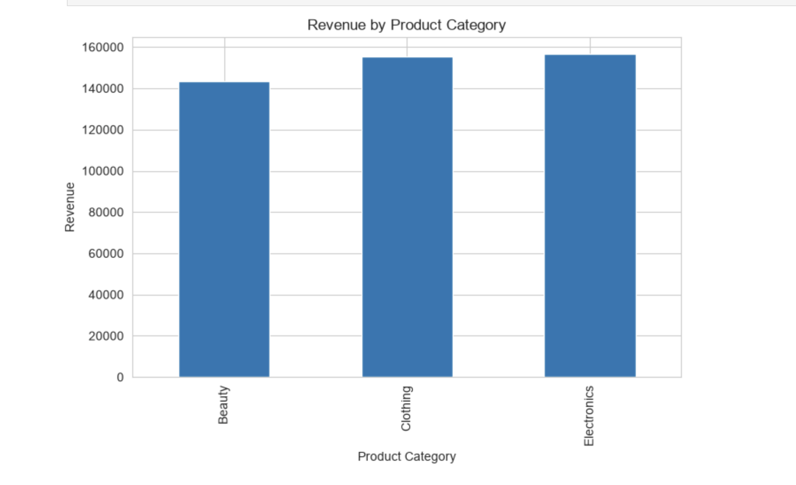
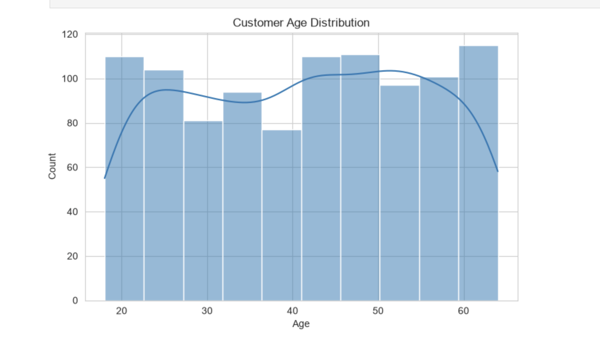

# Retail Sales EDA

## Overview
This project performs Exploratory Data Analysis (EDA) on a retail sales dataset using Python.

## Tools Used
- Python
- Pandas
- NumPy
- Matplotlib
- Seaborn
- Jupyter Notebook

## Analysis Performed
- Initial data inspection
- Missing value analysis
- Product category distribution
- Monthly and quarterly sales trends
- Revenue analysis
- Gender distribution analysis
- Customer age analysis
- Additional visualizations

## Key Insights
- No missing values were found in the dataset.
- Sales vary across product categories.
- Revenue trends differ across months and quarters.
- Customer demographics influence purchasing behavior.
- The analysis provides useful insights for business decisions.

## Files
- Ipshit_Task1_EDA_Retail_Sales.ipynb
- retail_sales_dataset.csv
- README.md

## Conclusion
Exploratory data analysis helps uncover patterns in customer behavior and sales performance, enabling better business decisions.
## Screenshots

### Graph 1

### Graph 2

